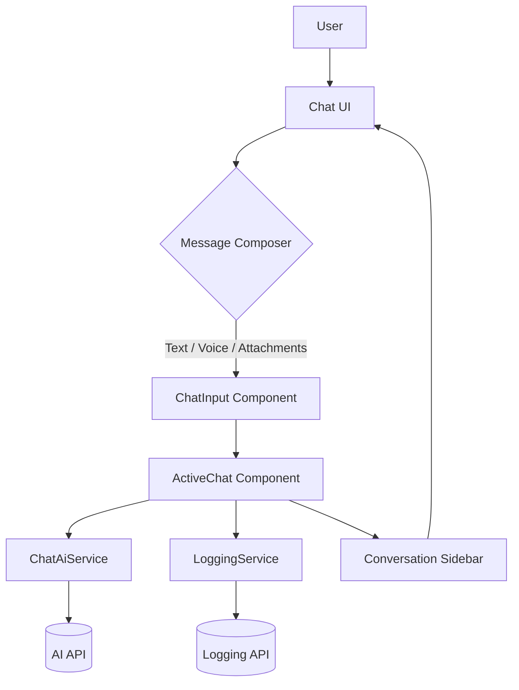
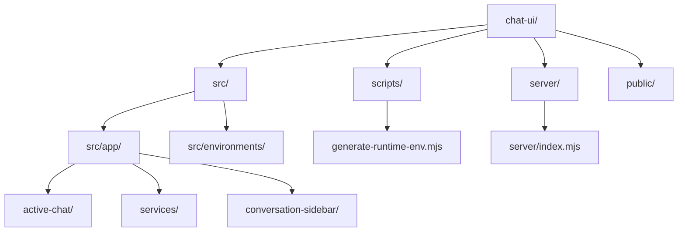

# Chat UI

Angular-powered conversational interface with multi-file uploads, AI integration, and adaptive layout tweaks.

## System Workflow



## Directory Map



## Design Highlights

- Glassmorphism-inspired chat layout with responsive spacing.
- Typing animation welcomes each user dynamically on the empty state screen.
- Sidebar toggle floats for quick access; multi-file attachments show pill previews and inline errors.
- Accessibility: keyboard shortcuts, ARIA attributes, reduced-motion fallback for animations.

## Local Setup

1. **Install dependencies**
   ```bash
   npm install
   ```
2. **Configure environment variables**
   - Copy `.env.example` to `.env`.
   - Replace placeholders with your AI endpoint, MSAL credentials, and logging API URL as needed.
   - Re-run `npm install` if you update `.env` so `runtime-env.generated.ts` refreshes (the pre* scripts handle this automatically).
3. **Run the dev server**
   ```bash
   npm start
   ```
   Visit `http://localhost:4200/` in your browser.
4. **Optional: start the logging microservice** (used for local log persistence)
   ```bash
   npm run start:server
   ```
   By default it listens on `http://localhost:4000`.
5. **Run tests**
   ```bash
   npm test
   ```

## Common Tasks

- **Generate components/services**
  ```bash
  ng generate component feature/my-component
  ng generate service feature/my-service
  ```
- **Build for production**
  ```bash
  npm run build
  ```
- **Lint and formatting guides**
  - Prettier is preconfigured via `package.json`.
  - Angular CLI handles TypeScript linting via `ng lint` (configure as needed).

## Additional Resources

- [Angular CLI documentation](https://angular.dev/tools/cli)
- [Angular Material](https://material.angular.io)
- [MSAL Angular](https://learn.microsoft.com/azure/active-directory/develop/msal-overview)
